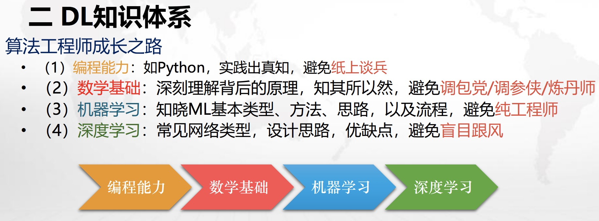
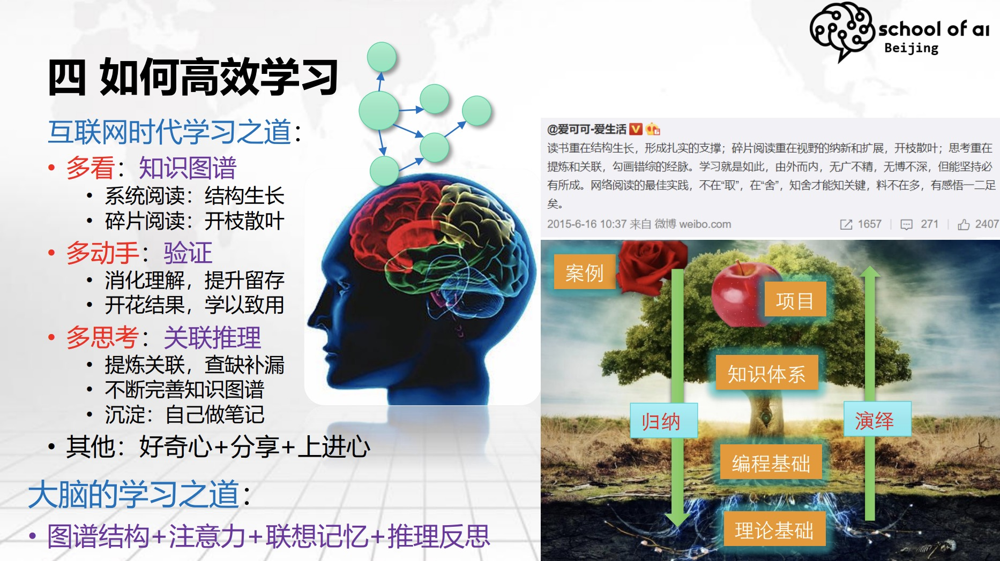
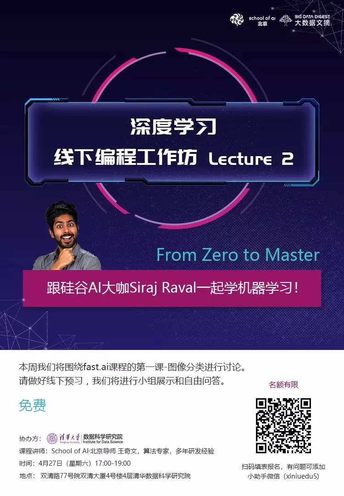

# [The School of AI Beijing](https://wqw547243068.github.io/school-of-ai-beijing)

 

- [SoAI-The School of AI主页](https://www.theschool.ai/)，[SoAI-Beijing项目主页](https://wqw547243068.github.io/school-of-ai-beijing)
- 温馨提示
> 如果在你浏览的是github里的readme文件，无法查看视频，请点击[The School of AI Beijing](https://wqw547243068.github.io/school-of-ai-beijing)

## 目录
- [关于SoAI](#关于soai)
- [学习资料](#学习资料)
   - [入门必读](#入门必读)
- [开发环境](#开发环境)
   - [本地环境](#本地环境)
   - [云环境](#云环境)
- [课程列表](#课程列表)
- [课程内容](#课程内容)
   - [第一课 深度学习入门指南](#第一课-深度学习入门指南)
   - [第二课 图像分类](#第二课-图像分类)
- [作业汇总](#作业汇总)
- [参考资料](#参考资料)
- [交流分享](#交流分享)
- [合作方](#合作方)
---

## 关于SoAI

- An international educational non-profit platform dedicated to studying, teaching and creating AI to help solve the world’s most difficult problems. Our mission is to offer a world-class AI education to anyone on Earth for free.  
- Siraj对SoAI的[介绍](https://www.bilibili.com/video/av37767979/)

<iframe src="//player.bilibili.com/player.html?aid=37767979&cid=66394634&page=1" scrolling="no" border="0" frameborder="no" framespacing="0" allowfullscreen="true" height="600" width="100%"> </iframe>

- 北京分部有中文、英文两个版本，详情：
   - 英语分支，每周一晚在朝阳，Max主讲 [en](other/SoAI_en.jpg)
   - 中文分支，每周末下午17:00，清华大学，海淀区双清路双清大厦4号楼4层清华数据科学研究院，王奇文等主讲，采用翻转课堂方式
,

### SoAI-北京

- [The School of AI Beijing官方论坛](https://forums.fast.ai/t/school-of-ai-beijing-study-group/43436)
- 网易课堂直播：[BEIJING SCHOOL OF AI WORKSHOP](https://study.163.com/course/courseMain.htm?courseId=1209149803)

### Fast.AI
- [Fast.AI官方课程主页](https://course.fast.ai/),[个人注册入口](https://forums.fast.ai/)

## 开发环境
- 多种方式：本地、云环境，由于不少项目需要GPU支持，建议采用云环境

### 本地环境
- 为什么大家都用jupyter notebook？深度学习代码只能在notebook上跑吗？
- 非也，notebook主要用于教学展示，代码分享，工程落地时，必须转成单个的python文件，按照机器学习的基本流程划分文件及目录，常见的结构如下：
   - data：数据目录，包含：
      - train.txt
      - test.txt
      - validation.txt（可选）
   - bin：核心代码，主要包含：
      - model.py：模型定义
      - feature.py：特征工程部分，离线训练和在线评估都有
      - train.py：模型训练代码
      - predict.py：在线预测（inference，推断）
   - model：模型存放
   - log：日志目录
      - 训练日志，如tensorboard日志
   - conf：配置文件
   - common：公共库、组件
      - eva.py：效果评估
   

### 云环境
   - [Google colab](https://colab.research.google.com)，与github直接打通，免费GPU（Tesla T4）
      - [如何用 Google Colab 练 Python](https://sspai.com/post/52980)
      - [Google Colab 免费GPU服务器使用教程](https://blog.csdn.net/cocoaqin/article/details/79184540)
   - 如果无法访问，建议使用Kaggle，[fastai接入指南](https://course.fast.ai/start_kaggle.html),[从0到1走进kaggle](https://blog.csdn.net/qunnie_yi/article/details/80129508)
      - 【2019-05-12】kaggle注册时可能收不到验证码，原因是伟大的墙，解决方法：①找个v-p-n②[kaggle注册无法激活怎么办](https://blog.csdn.net/sgfmby1994/article/details/77941021)
- [fastai官方代码库](https://github.com/fastai/course-v3)

## 学习资料
- 第1课的官方视频，[图像分类-需vpn](https://course.fast.ai/videos/?lesson=1),[bilibili-无需vpn](https://www.bilibili.com/video/av41718196?from=search&seid=15198798356009994731),[第1课的更新](https://forums.fast.ai/t/lesson-1-official-resources-and-updates/27936),[第一课笔记](https://github.com/hiromis/notes/blob/master/Lesson1.md)

### 入门必读
- 知识体系(参考第一次课：[深度学习入门指南](https://github.com/wqw547243068/school-of-ai-beijing/blob/master/resource/School%20of%20AI%20Beijing-20190421-%20%E7%AC%AC%E4%B8%80%E8%AF%BE%20%E6%B7%B1%E5%BA%A6%E5%AD%A6%E4%B9%A0%E5%85%A5%E9%97%A8%E6%8C%87%E5%8D%97.pdf))
- 
- 如何高效学习
   - 知乎：[为什么大多数人宁愿吃生活的苦，也不愿吃学习的苦？](https://www.zhihu.com/question/272483562/answer/376542013)（主动吃苦）
   - 学习金字塔: 
      - 主动学习＞被动学习
      - 教授＞总结＞实践＞看书>听课
      - 
   - 费曼技巧：[终极快速学习方法](https://www.zhihu.com/question/20576786)
   - 怎么成为大牛？走出舒适区，进入学习区
   - 大脑的学习之道：图谱结构+注意力+联想记忆+推理反思
   - 
- 数学基础：（选读，如果想深入学习，就必读）
   - 线性代数（35%）
      - 资料：[「Deep Learning」读书系列分享第二章：线性代数-分享总结](https://www.leiphone.com/news/201708/iL1S8jkc4ytZFzHS.html) 【文字版】, [线性代数笔记](https://note.youdao.com/share/?id=2dd5b67042a5a49bd81a450c0a7490be&type=note#/)
   - 概率与信息论（25%）
      - 资料：[「Deep Learning」读书系列分享第三章：概率和信息论-分享总结](https://www.leiphone.com/news/201708/lbN7eWYBcovwhhN7.html)，【文字版】
      - 其他资料：[Deep Learning解读合辑-国庆特辑](https://mp.weixin.qq.com/s?__biz=MjM5ODU3OTIyOA==&mid=503183187&idx=1&sn=cf18a77ef1249b589c89e23e0ddcae9e&chksm=3ec1ca2009b64336d14cacc57a4dadd6f732af61cf29b6517df7c1387d5eedcd00837dab88e3&mpshare=1&scene=23&srcid=0605oj6B3P1HddCiBJgOolQE#rd), 视频版
- Python生态圈
   - numpy, 矩阵运算工具，资料如下：
      - [70个NumPy分级练习：用Python一举搞定机器学习矩阵运算](https://www.toutiao.com/a6527910077834199566/?tt_from=mobile_qq&utm_campaign=client_share&timestamp=1525573097&app=news_article&utm_source=mobile_qq&iid=31862217871&utm_medium=toutiao_android)
      - [用python做科学计算——Numpy快速处理数据](http://old.sebug.net/paper/books/scipydoc/numpy_intro.html)
      - [python numpy笔记](https://www.zybuluo.com/chanvee/note/89078)
      - [知识点总结：脑图笔记](https://woaielf.github.io/2017/04/15/numpy/)
   - pandas，表格数据分析工具，资料如下：
      - [Pandas学习笔记-常用功能](https://zhuanlan.zhihu.com/p/25013519)
      - [十分钟搞定pandas](http://www.cnblogs.com/chaosimple/p/4153083.html)
      - [知识点总结：脑图笔记](https://woaielf.github.io/2017/04/22/Pandas/)
   - matplotlib,画图工具，资料如下：
      - [matplotlib官方教程](http://matplotlib.org/1.3.1/users/pyplot_tutorial.html)
      - [matplotlib核心剖析](http://www.cnblogs.com/vamei/archive/2013/01/30/2879700.html)
      - [知识点总结：脑图笔记](https://woaielf.github.io/2017/04/27/matplotlib/)
- 机器学习入门：
   - [机器学习基本流程](http://holbrook.github.io/2017/10/13/ML_index.html)
      - 
   - [可视化讲解机器学习](http://www.r2d3.us/%E5%9B%BE%E8%A7%A3%E6%9C%BA%E5%99%A8%E5%AD%A6%E4%B9%A0/)
   - [Google机器学习速成课](https://developers.google.cn/machine-learning/crash-course/)
   - [Scikit-learn官网](http://scikit-learn.org/stable/),[中文文档](http://sklearn.apachecn.org/cn/0.19.0/)
   - [Sklearn快速使用及经典算法实现](https://www.cnblogs.com/lianyingteng/p/7811126.html)
- 深度学习入门：
   - 布朗学院新鲜出炉，[交互式图解人工智能](https://okai.brown.edu/zh/index.html)
   - [Google PlayGround神经网络训练在线演示](http://playground.tensorflow.org/#activation=tanh&batchSize=10&dataset=circle&regDataset=reg-plane&learningRate=0.03&regularizationRate=0&noise=0&networkShape=4,2&seed=0.45786&showTestData=false&discretize=false&percTrainData=50&x=true&y=true&xTimesY=false&xSquared=false&ySquared=false&cosX=false&sinX=false&cosY=false&sinY=false&collectStats=false&problem=classification&initZero=false&hideText=false),[汉化版](http://playground.tensorflowjiaocheng.com/)，[手写数字识别3D交互体验](http://scs.ryerson.ca/~aharley/vis/conv/)
- 神经网络讲解【[3Blue1Brown优质讲解](https://www.bilibili.com/video/av15532370)】，该系列一共4个视频，第一个如下：
   - <iframe src="//player.bilibili.com/player.html?aid=15532370&cid=25368631&page=1" scrolling="yes" border="0" frameborder="no" framespacing="0" allowfullscreen="true" height="600" width="100%"> </iframe>
   - [神经网络Web Demo](https://playground.tensorflow.org/)，可在线体验神经网络训练过程
   - <iframe src="https://playground.tensorflow.org/" scrolling="yes" border="0" frameborder="no" framespacing="0" allowfullscreen="true"  height="600" width="100%"> </iframe>
- 神经网络3D仿真特效（多种网络结构对比）
   - <iframe src="//player.bilibili.com/player.html?aid=13942311&cid=22776951&page=1" scrolling="no" border="0" frameborder="no" framespacing="0" allowfullscreen="true" height="600" width="100%"> </iframe>
- [手写数字识别在线体验](http://scs.ryerson.ca/~aharley/vis/conv/)

## 课程列表

Fast.AI系列速成实战课程，时间安排如下：

|*时间*|*章节*|*题目*|*预习资源*|*正式解读*|*作业*|
|:----|:----|:------|:----|:----|:----|
|2019-04-21|介绍|深度学习入门指南|请完成ppt里提到的作业，长期|这节课长达2h，内容非常多，覆盖深度学习入门几乎全部知识点|完整看完80+页的ppt，并预习第二课|
|2018-04-27|第一课|宠物图片分类,[英文视频](https://course.fast.ai/videos/?lesson=1),[中文版笔记](https://forums.fast.ai/t/fast-ai-v3-2019/39325/74?u=daniel)|[Github代码](https://github.com/fastai/course-v3/blob/master/files/dl-2019/notes/notes-1-1-CN.md)|安装fastai环境并动手实现，代码解析：[Github本地](code/lecture_1/fastai_1_Image_Classification.ipynb),[Colab](https://colab.research.google.com/drive/14er2fMCOIyDcwFsV5Vm8LRRARAiiFZLm),[Kaggle](https://www.kaggle.com/wqw547243068/fastai-1-image-classification)|亲手执行本次代码，熟悉fastai环境|
|2018-05-12 |第二课|特征工程及SGD,[英文视频](https://course.fast.ai/videos/?lesson=2),[中文版笔记](https://forums.fast.ai/t/fast-ai-v3-2019/39325/79?u=daniel)|[Github代码](https://github.com/fastai/course-v3/blob/master/files/dl-2019/notes/notes-1-2-CN.md)|[github](https://github.com/wqw547243068/school-of-ai-beijing/tree/master/code/lecture_2),[colab](https://colab.research.google.com/drive/1KeHNLg96ttd-MNr-WTjSyFIuqFTTtRJE),[kaggle示例](https://www.kaggle.com/danielliao/fastai-v3-lesson-2-download-cn)|①熟悉fastai+kaggle环境②执行scikit-learn代码③学完google机器学习速成课速成课④预习神经网络fastai第五课|
|2018-05-* |第三课|多标签分类,[英文视频](https://course.fast.ai/videos/?lesson=3),[中文版笔记](https://forums.fast.ai/t/fast-ai-v3-2019/39325/78?u=daniel)|[Github代码](https://github.com/fastai/course-v3/blob/master/files/dl-2019/notes/notes-1-3-CN.md)|-|作业|
|2018-05-* |第四课|NLP&推荐系统,[英文视频](https://course.fast.ai/videos/?lesson=4),[中文版笔记](https://forums.fast.ai/t/fast-ai-v3-2019/39325/77?u=daniel)|[Github代码](https://github.com/fastai/course-v3/blob/master/files/dl-2019/notes/notes-1-4-CN.md)|-|作业|
|2018-05-* |第五课|从反向传播到神经网络,[英文视频](https://course.fast.ai/videos/?lesson=5),[中文版笔记](https://forums.fast.ai/t/fast-ai-v3-2019/39325/72?u=daniel)|[Github代码](https://github.com/fastai/course-v3/blob/master/files/dl-2019/notes/notes-1-5-CN.md)|-|作业|
|2018-05-* |第六课|正则化卷积,[英文视频](https://course.fast.ai/videos/?lesson=6),[中文版笔记](https://forums.fast.ai/t/fast-ai-v3-2019/39325/71?u=daniel)|[Github代码](https://github.com/fastai/course-v3/blob/master/files/dl-2019/notes/notes-1-6-CN.md)|-|作业|
|2018-05-* |第七课|Resnets、GAN等,[英文视频](https://course.fast.ai/videos/?lesson=7),[中文版笔记](https://forums.fast.ai/t/fast-ai-v3-2019/39325/69?u=daniel)|[Github代码](https://github.com/fastai/course-v3/blob/master/files/dl-2019/notes/notes-1-7-CN.md)|-|作业|
| -|-|-|-|-|-|作业|

最新课程安排见[project区](https://github.com/wqw547243068/school-of-ai-beijing/projects/1)，[Fastai中文笔记](https://forums.fast.ai/t/fast-ai-v3-2019/39325)

## 课程内容
- 本教程以[fastai的速成课](https://course.fast.ai/videos/?lesson=1)为蓝本（注意：需要vpn，如果没有，请往下看，找bilibili上的视频）

- 如有问题，可以去[SoAI论坛](https://forums.fast.ai/t/school-of-ai-beijing-study-group/43436)提问
---
- [ppt资源](https://github.com/wqw547243068/school-of-ai-beijing/tree/master/resource)
### 第一课 深度学习入门指南
- 深度学习入门全貌，请仔细看
### 第二课 图像分类
- 主题：fastai课程的第一课进行讨论：图像分类。
- 时间：于4月27日星期日下午5点举行
- 地点：双清路77号院双清大厦4号楼4层清华数据科学研究院

议程：
- 介绍fastai第1课的必要资源,如何获取fastai的资源
- 学生现场演示第一课作业
- 自由问答, 遇到困难

视频资料：（来自[哔哩哔哩](https://www.bilibili.com/video/av46252318?from=search&seid=14000263006142671716)）
- <iframe src="//player.bilibili.com/player.html?aid=46252318&cid=81036516&page=1" scrolling="no" border="0" frameborder="no" framespacing="0" allowfullscreen="true" height="600" width="100%"> </iframe>

## 作业汇总
- [作业提交指南](https://github.com/wqw547243068/school-of-ai-beijing/issues/2)
- [Homework](homework/README.md)
- 分线上和线下渠道，将自己的作业整理到github或colab，去project[作业汇总区](https://github.com/wqw547243068/school-of-ai-beijing/projects/2)新建自己的卡片
- 也可以去[Fast.AI论坛-SoAI区](https://forums.fast.ai/t/school-of-ai-beijing-study-group/43436)提问
   - 【注意】[如何在issue中提问](https://github.com/wqw547243068/school-of-ai-beijing/issues/1)

## 参考资料
###  CNN和CV
1. iris数据集+机器学习实战
1. CNN简介
   - 计算机视觉
      - [YJango的卷积神经网络——介绍](https://zhuanlan.zhihu.com/p/27642620),[SIFT与HOG特征提取](http://blog.csdn.net/taigw/article/details/42206311)
      - [李飞飞《让冰冷的机器读懂照片背后的故事》](http://www.ifanr.com/648667),[TED视频《我们怎样教计算机理解图片》](https://www.ted.com/talks/fei_fei_li_how_we_re_teaching_computers_to_understand_pictures?language=zh-cn),[网易公开课：《李飞飞：如何教计算机理解图片》](http://open.163.com/movie/2015/3/Q/R/MAKN9A24M_MAKN9QAQR.html)
   - CNN基本结构
      - 《神经网络与深度学习》吴岸城,[Deep Learning（深度学习）学习笔记整理系列之（一）](http://blog.csdn.net/zouxy09/article/details/8775360),[Andrew Ng 深度学习(Deep Learning)介绍](http://blog.sina.com.cn/s/blog_50a5cf290101r7a6.html)
      - [YJango的卷积神经网络——介绍](https://zhuanlan.zhihu.com/p/27642620),[卷积神经网络工作原理直观的解释？](https://www.zhihu.com/question/39022858)
      - [Yann LeCun连发三弹：人人都懂的深度学习基本原理（附视频）](https://www.leiphone.com/news/201612/Sjkmer9Kto5ILxFk.html?utm_source=itdadao&utm_medium=referral)
      - [卷积神经网络中用1*1 卷积有什么作用或者好处呢？](https://www.zhihu.com/question/56024942)
      - 手写数字识别[3D交互体验](http://scs.ryerson.ca/~aharley/vis/conv/)
      - [CNN发展历史](http://www.cnblogs.com/52machinelearning/p/5821591.html),[台大李宏毅：一天搞懂深度学习](http://v.youku.com/v_show/id_XMTY5NDUzNjIxNg==.html?from=s1.8-1-1.2&spm=0.0.0.0.LZsB12%EF%BC%8C%E4%B8%80%E5%A4%A9%E6%90%9E%E6%87%82%E6%B7%B1%E5%BA%A6%E5%AD%B8%E7%BF%92--%E5%AD%B8%E7%BF%92%E5%BF%83%E5%BE%97)

1. 应用
   - 目标检测,作业：[Tensorflow lite在移动设备上的运行Demo](https://blog.csdn.net/masa_fish/article/details/54097796)
   - 人脸识别,作业：[python的人脸识别工具包face recognition](https://github.com/ageitgey/face_recognition)
   - 参考资料：[Large Pose 3D Face Reconstruction from a Single Image via Direct Volumetric CNN Regression](http://aaronsplace.co.uk/papers/jackson2017recon/),[2D图像三维重建Demo体验地址](http://www.cs.nott.ac.uk/~psxasj/3dme/view.php?name=../59b415560b915),[表情替换，DeepWarp Demo Page](http://163.172.78.19/)
   - 颜值预测，[一个基于 TensorFlow 的「颜值评分」开源项目：FaceRank](https://zhuanlan.zhihu.com/p/28208481)
1. 反思
   - [Geoffrey Hinton多伦多大学演讲：卷积神经网络的问题](http://www.sohu.com/a/165989490_465975)
   - [Hinton的Capsule论文全公开！首发《胶囊间的动态路由》原文精译，了解Hinton的胶囊网络ㅣ第一部分：直觉](http://mp.weixin.qq.com/s/gAFKrUjfQyqaDKNyMRitZg)

## 交流分享
欢迎大家入群分享、交流！
- [Fast.AI论坛-SoAI北京区](https://forums.fast.ai/t/school-of-ai-beijing-study-group/43436)（英文为主）
- The School of AI 北京中文版 QQ群

## 合作方
- 大数据文摘+清华数据科学院研究院

- 举办地点：清华大学
- 时间：每周末一次，如想参加，请先文摘助手微信，往期海报如下：

---
<iframe src="https://ghbtns.com/github-btn.html?user=wqw547243068&amp;repo=school-of-ai-beijing&amp;type=watch&amp;count=true&amp;size=large" allowtransparency="true" frameborder="0" scrolling="0" width="156px" height="30px"></iframe>
<iframe src="https://ghbtns.com/github-btn.html?user=wqw547243068&amp;repo=school-of-ai-beijing&amp;type=fork&amp;count=true&amp;size=large" allowtransparency="true" frameborder="0" scrolling="0" width="156px" height="30px"></iframe>
---

---
<!-- Global site tag (gtag.js) - Google Analytics -->

---
